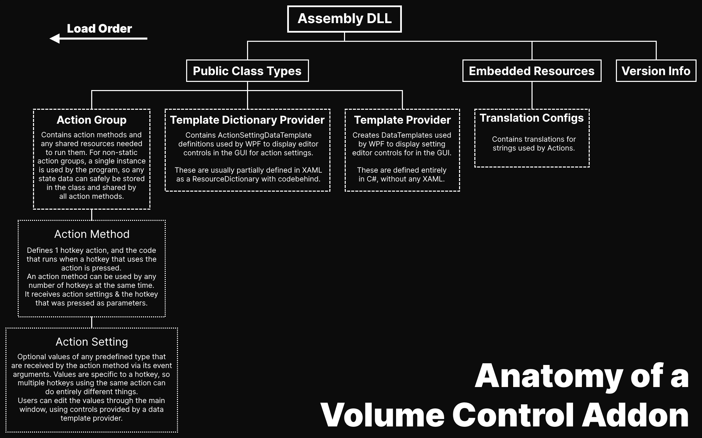

# Addon Development
Addons are written in C# with .NET Core 6 - you don't need any previous experience with C# in order to create addons, but this is not a tutorial for learning C#.  


## Environment Setup
This assumes you're using Visual Studio with the **.NET/C#** workload installed.  

 1. Create a new **.NET Core 6 Class Library** type solution, and name it whatever you want.  
      
      
 2. R+Click on your `.csproj` file and click **Properties**. In the property pages, change the **Target OS** to **Windows**:  
      
    Press *Ctrl+S* to save the project file, then close the tab.
 3. In the solution explorer, R+Click on your project and select **Manage NuGet Packages for Project**  
      
 4. Switch to the **Browse** tab & install the `VolumeControl.SDK` package.  
      
    
## Writing an Addon

Here's an example of an action that opens a file using the default application.

```csharp
using System.Diagnostics;
using VolumeControl.Core.Attributes;
using VolumeControl.Core.Input;

namespace VolumeControl.TestAddon
{
    [HotkeyActionGroup("File", GroupColor = "#F0F")]
    public class FileActions
    {
        [HotkeyAction(Description = "Opens a file with the default application.")]
        [HotkeyActionSetting("Path", typeof(string), Description = "The location of the file to open.")]
        public void OpenFile(object? sender, HotkeyPressedEventArgs e)
        {
            Process.Start(new ProcessStartInfo(e.GetValue<string>("Path"))
            {
                UseShellExecute = true
            })?.Dispose();
        }
    }
}
```

You can find the full code example [here](https://github.com/radj307/volume-control.TestAddon).  
Additionally, you can view the source code for Volume Control's built-in actions [here](https://github.com/radj307/volume-control/tree/main/VolumeControl.HotkeyActions).

See the **[API Documentation](https://github.com/radj307/volume-control/wiki/API-Documentation)** for more information on what is available through the Volume Control SDK.

## Building Your Addon

Assuming you're using Visual Studio, you can use **Publish Profiles** to build your addon and place it in an easy-to-access directory.  

First, you'll need to create a new publish profile.

 1. R+Click your addon project in the solution explorer, and select **Publish...**  
    
 2. When asked to choose a target, select **Folder**.  
    
 3. Choose an output directory; this should be a **relative** path that points somewhere within your solution directory / git repository.  
      
 4. Do any additional configuration you want on your new publish profile.  
      
 5. Click the **Publish** button to build your addon.  
    The output files *(and only the output files)* can be found at the location you set in step 3.   
    

## Loading Your Addon

*Tip: In order to see log messages related to the loading of addons, you should enable all of the log filters in the settings tab.*

### Where to Put Addons

Volume Control will attempt to load addons from a few locations, depending on the version.  
Since v6.0.0, Volume Control will *(recursively)* load addons from `C:\Users\<USERNAME>\AppData\Local\radj307\VolumeControl\Addons` first, if that location exists.  
**Do not place Volume Control SDK dlls in addon directories, and do not include them when redistributing your addon.**  

Since [v5.1.0](https://github.com/radj307/volume-control/release/5.1.0), addons may also be located in any directories specified by the `CustomAddonDirectories` setting, which can be found in the configuration file:  
*(until [v5.2.0](https://github.com/radj307/volume-control/releases/5.2.0)):* `~/AppData/Local/radj307/VolumeControl_Url_<HASH>/<VERSION>/user.config`  
*(since [v5.2.0](https://github.com/radj307/volume-control/releases/5.2.0)):* `volumecontrol.json` located in the same directory as `VolumeControl.exe`  

Assuming you enabled `DEBUG` log messages, you will see messages in the log confirming that your addon was loaded when launching Volume Control:  


## Redistributing Addons

Once you've got your shiny new addon, you may want to distribute it to share your work.  
To encourage this, I've created an official repository for third-party addons [here](https://github.com/radj307/volume-control.Addons).  
Submit a pull request (or issue) including your addon DLL to add it to the repo! Be sure to include "@radj307" so I get notified.

> ### Legal
> Because Volume Control is licensed under the [GPLv3](https://github.com/radj307/volume-control/blob/main/LICENSE), any code that uses the Volume Control SDK **must be licensed under the GPLv3 as well**; however **you are the sole owner** of the code that you write.  
> The only real requirement for you to remain compliant with the GPLv3 license is that you must make the source code for your addon available to users.
> #### Summary:
> - Make sure you use the [GNU General Public License 3 (GPLv3)](https://github.com/radj307/volume-control/blob/main/LICENSE) license for your addon when uploading it to github or elsewhere.
> - Make the source code for your addon available to users.
